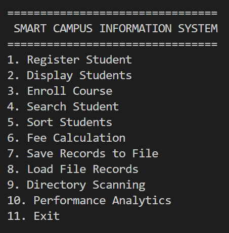
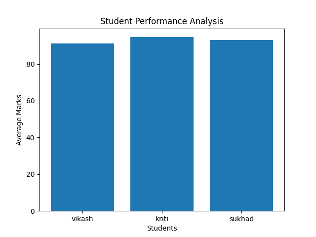

# Smart Campus Information System

A Python-based Smart Campus Information System developed as a mini project integrating concepts from Lab 1 to Lab 8.

## Submitted By

**Vikash Raj**  
**USN: 1DS25CY061**

---

## Project Overview

The Smart Campus Information System is a menu-driven Python application that helps manage student information efficiently. The system allows student registration, course enrollment, academic performance analysis, fee calculation, file handling, and data visualization.

---

## Features

### Student Management
- Register new students
- Store student details
- Calculate total marks and average
- Generate grades automatically

### Course Enrollment
- Enroll students in available courses
- Prevent duplicate enrollments

### Student Search
- Search students using USN

### Sorting
- Sort students based on average marks

### Fee Management
- Calculate final fee after scholarship deduction

### File Handling
- Save student records to CSV file
- Load and display saved records

### Directory Scanning
- Display files available in the current directory

### Performance Analytics
- Calculate:
  - Class Average
  - Highest Average
  - Lowest Average
- Display data using Pandas DataFrame
- Generate graphical analysis using Matplotlib

---

## Technologies Used

- Python
- NumPy
- Pandas
- Matplotlib
- CSV Module
- OS Module

---

## Project Structure

```
smart_campus_project.py
student_records.csv
README.md
```

---

## Available Courses

1. Python Programming
2. Data Structures
3. Artificial Intelligence
4. Machine Learning
5. Cyber Security

---

## Grade Calculation

| Average Marks | Grade |
|--------------|--------|
| 90 and above | A+ |
| 75 - 89 | A |
| 60 - 74 | B |
| 40 - 59 | C |
| Below 40 | Fail |

---

## How to Run

1. Install Python 3.x
2. Install required libraries

```bash
pip install numpy pandas matplotlib
```

3. Run the program

```bash
python smart_campus_project.py
```

---

## Screenshots

### Main Menu





---

## Performance Graph




---

## Future Enhancements

- Database Integration (MySQL)
- GUI using Tkinter
- Attendance Management
- Faculty Management
- Login Authentication System
- Web-based Dashboard

---

## Conclusion

The Smart Campus Information System demonstrates the implementation of Python programming concepts including functions, dictionaries, file handling, NumPy, Pandas, and Matplotlib. The project provides an efficient way to manage student information and analyze academic performance.

---

## Author

**Vikash Raj**  
**USN: 1DS25CY061**
